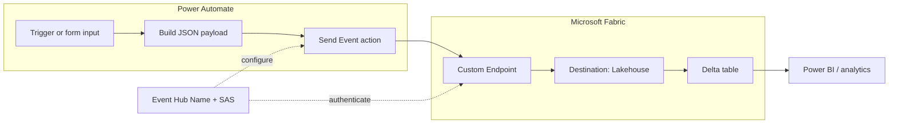

# From Flow to Fabric: Connect Power Automate to Microsoft Fabric

This guide shows how to send events from Power Automate to Microsoft Fabric using Eventstream and land them in a Lakehouse Delta table. Use this to bridge business logic (flows) with analytics (Fabric): capture user inputs, trigger insights, and power dashboards.

## Overview
- Power Automate posts events via the **Send Event** connector
- Microsoft Fabric **Eventstream** ingests those events
- Events are written to a **Lakehouse** table (Delta format)
## Prerequisites
- Access to https://app.fabric.microsoft.com and permission to create a **Workspace**, **Lakehouse**, and **Eventstream**
- Power Automate with access to the **Send Event** trigger/connector

### Workflow Flowchart

## Step-by-Step

### 1) Create a Power Automate Flow
- Build a simple flow that accepts an input (e.g., `Name`).
- Add the **Send Event** action to the flow.
- Keep the flow drafted; you’ll complete connections after setting up Fabric.

### 2) Set Up Microsoft Fabric
- In Fabric: create a **new Workspace**.
- Add a **Lakehouse** (via "+ New Item").
- Add an **Eventstream** (via **Get Data**) and select **Custom Endpoints**.

### 3) Configure Eventstream Input & Publish
- Name your input and click **Publish**.
- After publishing, open **Details** → **SAS Key Authentication**.
- Copy the **Event Hub Name** and **Primary Connection String**.

### 4) Connect Power Automate to Fabric
- Back in your flow, configure **Send Event**:
  - Use your **Workspace Name** to form the connection.
  - Paste the **Primary Connection String** and create the connection.
  - Manually enter the **Event Hub Name** (it may not populate automatically).
- In the **Content** field, pass the payload you want (e.g., `{ "Name": "YourValue" }`).

### 5) Set the Lakehouse Destination
- In Eventstream, choose **Lakehouse** as the destination and connect to your Workspace.
- For the table:
  - Choose **Create New** under **Delta Table**, or
  - Point to an **existing** Delta table in the Lakehouse.
- Tip: If data doesn’t land, first create the table in the Lakehouse, then reconfigure the Eventstream connection.

### 6) Finalize & Publish
- Complete the connection and **Publish**.
- Trigger the flow—events should now appear in the Lakehouse Delta table.

## What’s Next
- **Advanced analytics** with notebooks
- **Real-time Power BI** dashboards
- **Machine learning** integrations

## Troubleshooting
- **Event Hub name missing**: Enter it manually when setting up the Power Automate connection.
- **No rows in Lakehouse**: Verify the table exists and the Eventstream destination points to the correct Workspace and Lakehouse.
- **Schema mismatch**: Ensure the payload keys (e.g., `Name`) match the columns in the Delta table.

